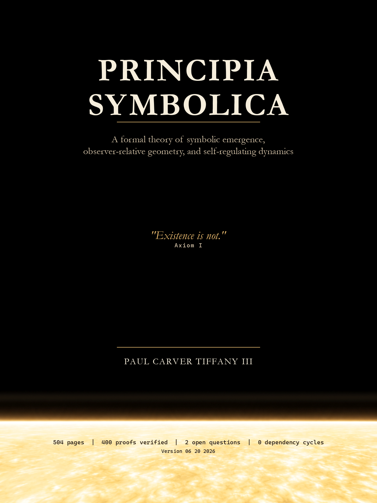

<p align="center">
  
</p>

<p align="center">
  <a href="build/main.pdf"><strong>Read the PDF</strong></a>
  &nbsp;|&nbsp;
  <a href="bib/principia_atlas.json"><strong>LLM atlas</strong></a>
  &nbsp;|&nbsp;
  <a href="bib/notebooklm_atlas/README.md"><strong>NotebookLM atlas</strong></a>
  &nbsp;|&nbsp;
  <a href="AGENTS.md"><strong>LLM guide</strong></a>
  &nbsp;|&nbsp;
  <a href="src/main.tex"><strong>Source</strong></a>
  &nbsp;|&nbsp;
  <a href="LICENSE"><strong>CC BY 4.0</strong></a>
</p>

# Principia Symbolica

*Principia Symbolica* is a mathematical manuscript about bounded observers,
symbolic emergence, observer-relative geometry, and self-regulating dynamics.

The LaTeX source lives in [`src/`](src/). The compiled manuscript is
[`build/main.pdf`](build/main.pdf).

## Machine-Readable Atlas

For LLMs and source-grounded tooling, use the atlas rather than the PDF text
layer:

- [`bib/principia_atlas.json`](bib/principia_atlas.json) is the canonical
  machine-readable atlas. It preserves each labelled object with source body,
  proof status, resolved citations, dependency edges, and macro usage.
- [`bib/README_FOR_LLMS.md`](bib/README_FOR_LLMS.md) explains the atlas schema,
  dependency direction, proof-status meanings, and machine-reader cautions.
- [`bib/notebooklm_atlas/`](bib/notebooklm_atlas/) contains Markdown exports for
  tools such as NotebookLM that ingest Markdown more reliably than JSON.

Recommended NotebookLM upload set:

1. [`bib/notebooklm_atlas/principia_atlas_notebooklm_full.md`](bib/notebooklm_atlas/principia_atlas_notebooklm_full.md)
   for the full high-fidelity atlas in Markdown.
2. [`bib/notebooklm_atlas/books/`](bib/notebooklm_atlas/books/) for per-book
   chunks when a smaller source set is more practical.
3. [`bib/notebooklm_atlas/principia_atlas_notebooklm_compact.md`](bib/notebooklm_atlas/principia_atlas_notebooklm_compact.md)
   as a smaller all-node index.

Regenerate the NotebookLM Markdown export with:

```powershell
python ci/build_notebooklm_atlas.py
```

## Atlas Reading Rules

- Labels such as `definition:bk1_bounded_observer` are stable source addresses.
- `Depends on` points toward supports and foundations.
- `Cited by` points toward later uses.
- `Proof status` is local atlas status, not external academic acceptance.
- The Markdown exports include cleaned reading text and, in the high-fidelity
  export, verbatim LaTeX bodies for exact recovery.

## Agent Guidance

AI agents should read [`AGENTS.md`](AGENTS.md) before editing. In brief: verify
formal claims through the index/atlas, do not invent labels or proofs, preserve
the manuscript's register, and run the repository checks after source edits.
